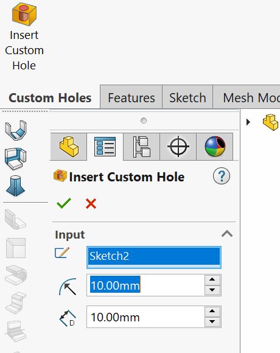
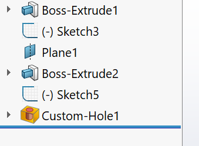
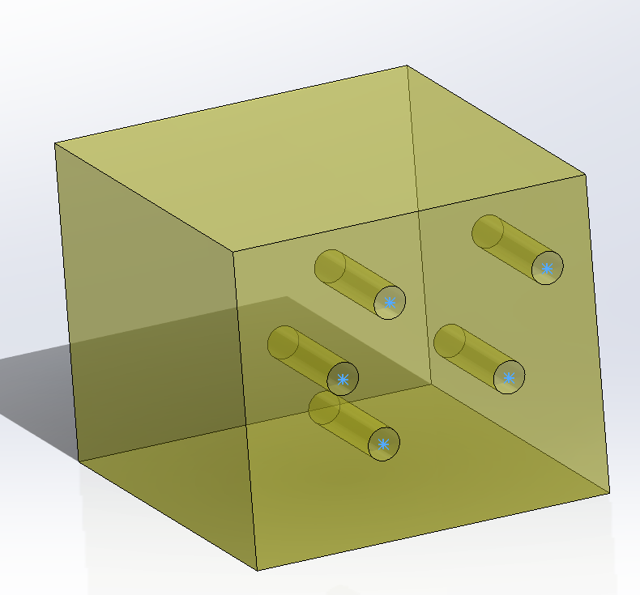
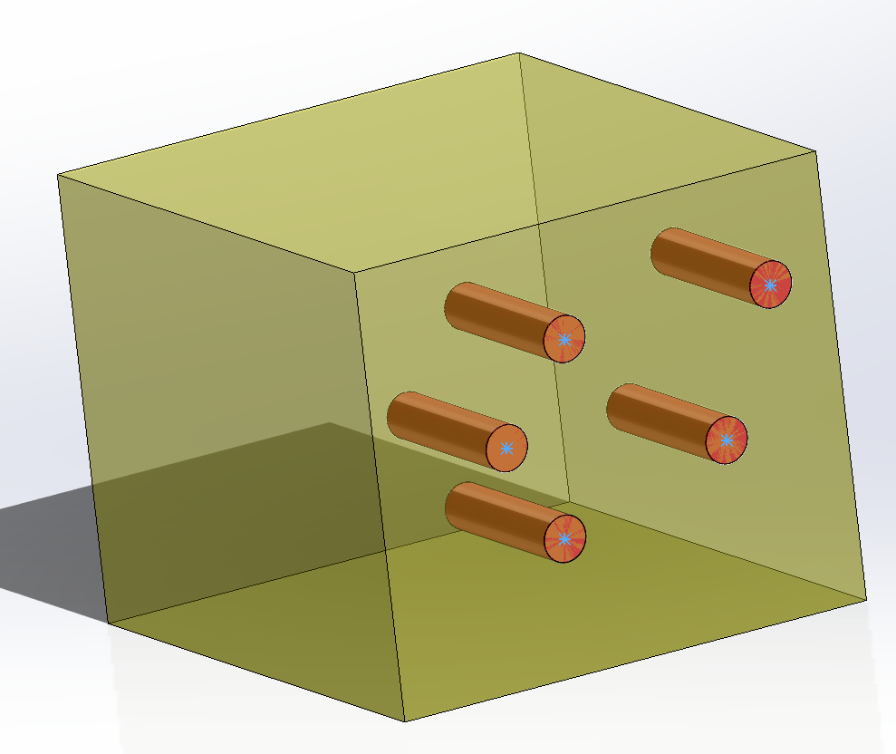

# Custom Holes Macro Feature

This example demonstrates how to create parametric macro feature which generates holes cuts in based on the sketch points of the selected sketch, radius and depth

Preview is dynamically displayed and updated while feature is being inserted or edited.

Macro feature is inserted into the Feature Manager tree and can be edited, suppressed or deleted.

Sketch points can be changed and this will result in automatic regeneration of the feature geometry.

This example also demonstrates how to customize the preview.

By default the macro feature preview will produce the geometry of the actual result, for example

xCAD.NET allows to customize the preview. In this example the editing body will be displayed in semi-transparent yellow color, while the hole cutouts will be displayed as red solid bodies

