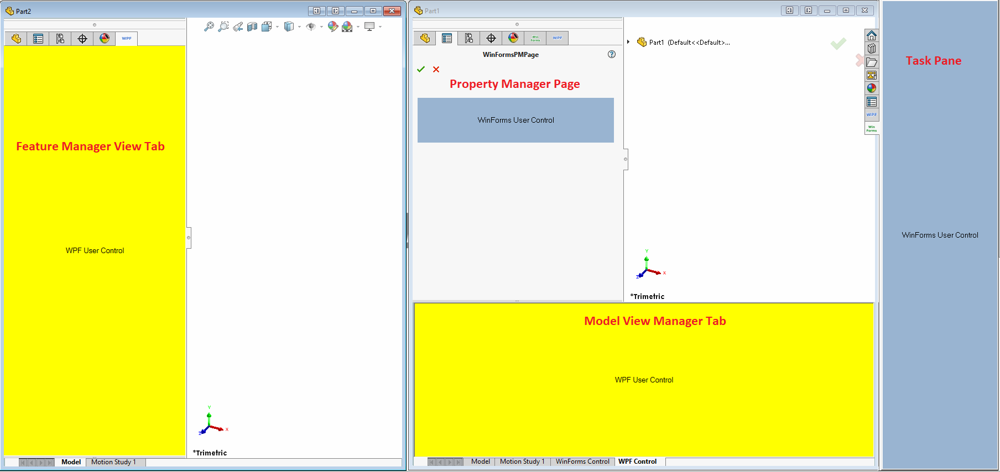
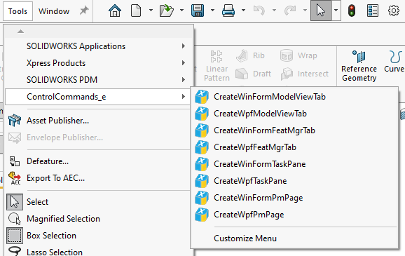

This example demonstrates how to customize various panels in SOLIDWORKS ([Task Pane](https://xcad.xarial.com/extensions/panels/task-pane/), [Model View Manager Tab](https://xcad.xarial.com/extensions/panels/model-view-tab/), [Feature Manager Tab](https://xcad.xarial.com/extensions/panels/feature-manager-tab/), [Property Manager Page](https://xcad.xarial.com/property-pages/controls/custom/)) by adding custom WPF or WinForms controls using [xCAD.NET](https://xcad.net)

Click button in the menu to create a corresponding panel.

