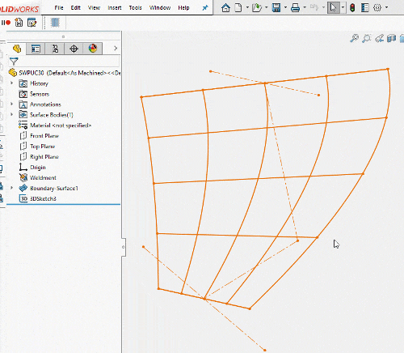
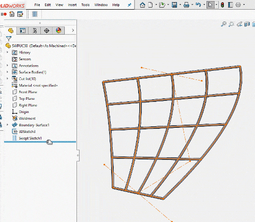
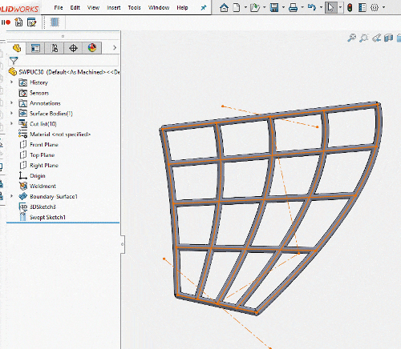

# Swept Sketch

This SOLIDWORKS add-in allows to create collection of swept solid bodies based on the input sketch (2D or 3D). This is a proposed solution for the [30th SOLIDWORKS Power-User Challenge](https://forum.solidworks.com/thread/245173).

## Installation

Download the add-in [SweepSketch.zip file here](https://github.com/xarial/xcad-examples/releases/tag/0.1). Unzip the archive. Tun **register.cmd** file to install the add-in (you might need to run this as administrator). Use **unregister.cmd** to uninstall the add-in.

Add-in adds new command to menu, toolbar and command tab box called **Tools->Geometry+->Insert Sweep Sketch**

Add-in is implemented using macro features. Model can be saved and reopened and feature will behave as normal.

## Inserting

Once command is clicked Property Manager Page is displayed. Select input sketch and specify the diameter value to generate the model. Preview is updated dynamically

## Editing

Parameters of the feature can be modified at any time, similar to standard feature of SOLIDWORKS

## Parametric Sketch

Feature preserves parametric behavior and will automatically updated once the original sketch changes.

