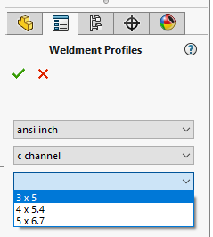

This example demonstrates how to create dynamic combo boxes in the SOLIDWORKS Property Manager page to display the list of available configured weldment profiles.

This example emulates the Property Manager Page of Structural Member Feature.

Each combo box depends on the value of previous box and updates its items based on the parent combo box selection

There are 3 combo boxes in the property page

* Standard - reads all the top level folders from the first weldment profiles path
* Type - lists of the files of the selected Standard folder
* Size - all the configurations of the selected Type file